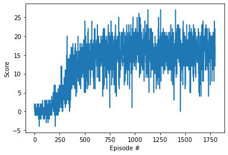

# 
Continuous Control Approach   

## Problem  
The problem at hand is a navigation problem where an agent is tasked to collect yellow bananas. Collecting black bananas result in negative reward and episode termination.

## Algorithmic Choice
The problem is a continuous state-space of 37 values, and a discrete action-space with 4 values.  
Such problem can be solved with discretization or with policy based approaches. I decided to go with Deep Q-Networks (DQN) algorithm that can handle continuous state spaces.

## Environment based optimization
First start to configure the training network and training episode function to start training and investigating.   
I started with Deep Q algorithm and test configure it and test performance along the environment. At first the performance was not good but after including multiple things like batch normalization and weight initialization according to Glorot and Bengio's paper. I got a good result. After that I noticed the algorithm barely learn anything useful in the first 100 episodes or so due to having yet unclear reward structure. I introduced a batch based equation that at the beginning train the structure less than proceed to training more as we get closer to higher batches(more useful info). As such the algorithm went quickly through the first episodes then start improving drastically afterward leading to faster convergence.

## Results
I trained the model multiple times to see how it would preform in different initial conditions. Initially I cleared the environment at the 474th episode(followed by over 100 episodes with 13+ rewards). But I changed and tested many parameters with many integration to see the model with clear by 505 for now.

Here is the score for agent showing rewards each episode:  
  

## Future Work
I want to test with the PPO structure and benchmark it along with DDPG and other algorithms.