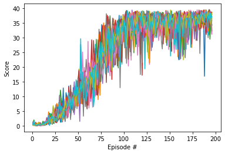
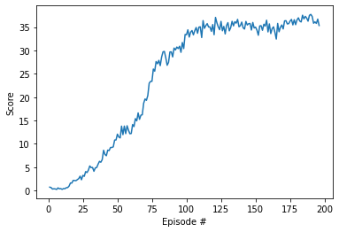

# 
Continuous Control Approach   

## Problem  
The problem at hand is the continuous Control problem with double joint arm following ball that are moving in changing velocities based on episode reset.

## Algorithmic Choice
The problem is a continuous state-space of 33 values, and a continuous action-space with 4 values.  
Such problem can be solved with discretization or with policy based approaches. I decided to go with Deep Deterministic Policy Gradient (DDPG) which is an Actor Critic method that is based on Deep Q-Networks (DQN) algorithm that can handle continuous action spaces.
DDPG consist of Actor and Critic networks. The Actor network is responsible for deciding the best action outputs the Q actions. While the Critic criticize the chosen action producing the value function which measures the action decided by the Actor. Tried multiple model structures for both networks the best performance i got was with batch size of 160 training from replay buffer. the network structure consist of 3 linear layers. With mish activation that starts with 160 units with hidden layer of (1-0.2)*160=128 units moving to final output which is 4 regressed values. While turning the parameters i notice that the weight decay(L2) actually stagnated the learning. so i turned i it off. i tried increasing the batch size along with layer units, but it was talking longer to reach so i lower it to 128. Likewise for learning rate. i found it to preform better with similar learing rate for both structures and finalize it as 1e-3.  
when it comes to discount factor and soft update parameter. i found the model to be unstable with smaller values so i went with 0.99 and 1e-3. Although 0.95 was good. i liked the stability of 0.99.

## Environment based optimization
First start to configure the training network and training episode function to start training and investigating.   
i started of with the 20 agents environment and implement the necessary parts to add all 20 agents information into the replay buffer. then proceeded to adjust the training step to update the model 20 times each update step to cope with the 20 agents. but the model started to overfit and couldn't proceed ahead due to update frequency being too much.  
The weights would become too big leading to overfitting so i clipped the gradient weights so the model would stabilize.  
This in turn made the algorithm more stable but the updates are still too much within similar buffer over all so i changed the update frequency to every 20 step instead with 10 updates each update iteration. after that the algorithm became stable and managed to clear the environment.  
I tested some model structure changes and settled with 160 units for first layer followed by 128 units for second layer with 20% decrement. there was also new paper at the end of 2019 that showed promising new activation layer called mish. Which uses tanh and softplus. i replaced my leaky relu and it improved overall generalizability of the model.

## Results
I trained the model multiple times to see how it would preform in different initial conditions. Initially i cleared the environment at the 40th episode(followed by over 100 episodes with 30+ rewards). but i retried again to see the model with clear by 97. Initially the model would stagnate a bit based on how fast the ball is. which would confuse the model as it would barely have any reward. then over many iterations it would collect enough samples to figure out that it needs to follow the ball.

Here is the score for 20 agents showing each agent during each episode:  
  
a bit hard to see but the fluctuation got smaller at the end indicating the stability of the model.
For the overall average reward for all agents:
  
The model shows good stability within the rewards by the 196 episode. you can find both my Actor and Critic weights to test.

## Future Work
The fastest convergence i got was by the 40+100 episode. i believe by using a Gaussian based model by varying mean and standard deviation that i can get even better overall score. i already implemented A2c and tested it but there was a negative loss issue that stagnated the learning. i will investigate the issue more and test other relevant algorithms to benchmark with.